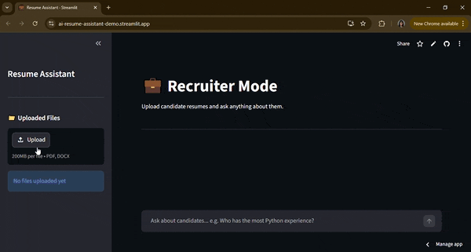

# 💼 Resume Assistant

An AI-powered resume analysis tool built with Streamlit. Upload candidate resumes and ask natural language questions — compare skills, find top candidates, or get personalized career advice.

---

## 🎬 Demo

<!-- Add a short screen recording or GIF here -->


🔗 **Live App:** [Open on Streamlit Cloud](https://ai-resume-assistant-demo.streamlit.app/) 

---

## ✨ Features

- **Recruiter Mode** — Upload multiple resumes and query across all of them. Ask things like *"Who has the most Python experience?"* or *"Which candidate has a background in project management?"*
- **Multi-file support** — Upload and manage multiple PDF or DOCX files simultaneously
- **Semantic search** — Queries use vector similarity to find the most relevant resume sections, not just keyword matching
- **Conversation memory** — Maintains recent chat history for follow-up questions
- **File management** — Add or remove uploaded files on the fly without restarting

---

## 🛠️ Tech Stack

| Layer | Technology |
|---|---|
| **Frontend / UI** | [Streamlit](https://streamlit.io/) |
| **LLM** | [Google Gemini 2.5 Flash](https://deepmind.google/technologies/gemini/) via `google-genai` |
| **Vector Database** | [ChromaDB](https://www.trychroma.com/) (in-memory) |
| **PDF Parsing** | [PyPDF2](https://pypdf2.readthedocs.io/) |
| **DOCX Parsing** | [python-docx](https://python-docx.readthedocs.io/) |
| **Environment Config** | [python-dotenv](https://pypi.org/project/python-dotenv/) |
| **Language** | Python 3.9+ |

---

## 📁 Project Structure

```
resume-assistant/
├── app.py           # Recruiter mode (single-mode entry point)
├── chatbot.py       # LLM integration (Gemini API)
├── retriever.py     # ChromaDB vector store + file parsing
├── .env             # API keys (not committed)
├── requirements.txt
└── README.md
---

## 🧠 How It Works

1. **Upload** — Resume files (PDF or DOCX) are parsed and split into 500-character chunks
2. **Embed & Store** — Chunks are stored in ChromaDB, tagged with their source filename
3. **Query** — When you ask a question, ChromaDB finds the top 5 most semantically relevant chunks
4. **Generate** — The relevant context + conversation history is sent to Gemini, which generates a grounded answer
5. **Attribute** — Each answer cites which file the information came from

---

## ⚠️ Important Notes

- The ChromaDB vector store is **in-memory** — data is cleared when the app restarts. Uploaded files need to be re-added each session.
- The app currently uses `PyPDF2` for PDF extraction, which may struggle with scanned/image-based PDFs.

---

## 📄 License

MIT License — feel free to use, modify and distribute.

---

## 🙋 Author

Built by Pranavi Chintakindi (https://github.com/pranavic72)  
Feel free to open issues or PRs!
